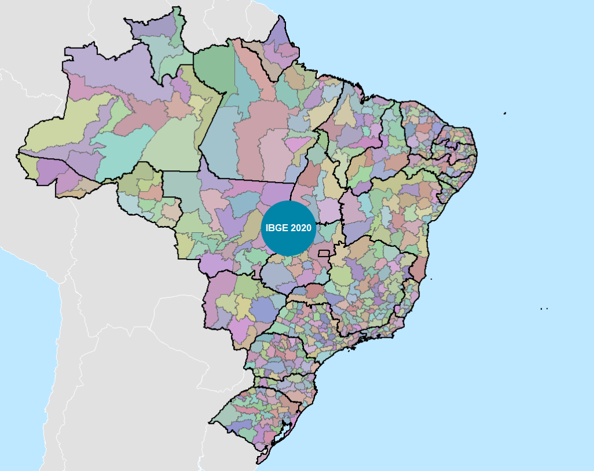
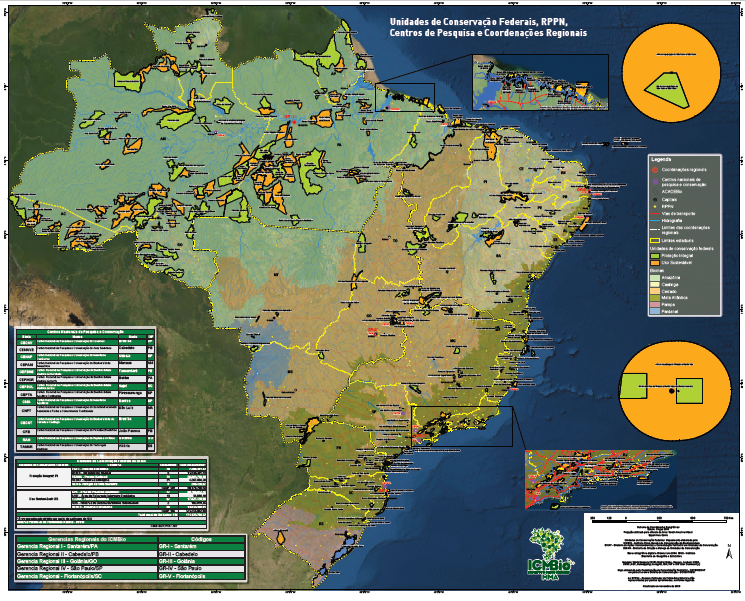
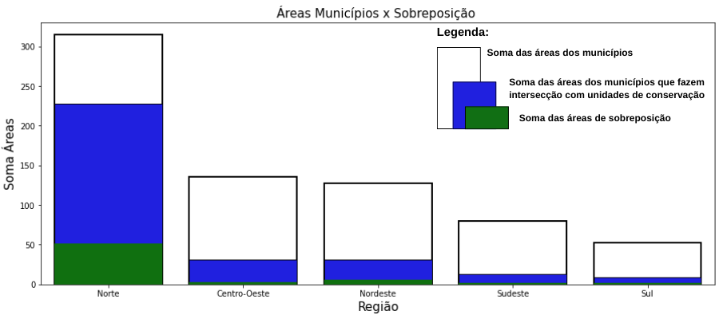

# Bem-vindo à Análise de Dados dos Municípios e Unidades de Conservação

---
## Sumário

[1 - Descrição do Projeto](https://github.com/lfreitasds/IBGE-Geoprocessing#1---descri%C3%A7%C3%A3o-do-projeto)  
[2 - Conjunto de Dados](https://github.com/lfreitasds/IBGE-Geoprocessing#2---conjunto-de-dados)
* [2.1 - Municípios](https://github.com/lfreitasds/IBGE-Geoprocessing#21---munic%C3%ADpios)
* [2.2 - Unidades de Conservação](https://github.com/lfreitasds/IBGE-Geoprocessing#21---munic%C3%ADpios)  
[3 - Considerações](https://github.com/lfreitasds/IBGE-Geoprocessing#3---considera%C3%A7%C3%B5es)  
[4 - Estratégia de Solução](https://github.com/lfreitasds/IBGE-Geoprocessing#4---estrat%C3%A9gia-de-solu%C3%A7%C3%A3o)
* [Passo 01 - Instalar biblioteca GeoPandas](https://github.com/lfreitasds/IBGE-Geoprocessing#passo-01---instalar-biblioteca-geopandas)
* [Passo 02 - Importar bibliotecas](https://github.com/lfreitasds/IBGE-Geoprocessing#passo-02---importar-bibliotecas)
* [Passo 03 - Carregar os dados](https://github.com/lfreitasds/IBGE-Geoprocessing#passo-03---carregar-os-dados)
* [Passo 04 - Separar os municípios por região](https://github.com/lfreitasds/IBGE-Geoprocessing#passo-04---separar-os-munic%C3%ADpios-por-regi%C3%A3o)
* [Passo 05 - Calcular as áreas dos municípios e das unidades de conservação](https://github.com/lfreitasds/IBGE-Geoprocessing#passo-05---calcular-as-%C3%A1reas-dos-munic%C3%ADpios-e-das-unidades-de-conserva%C3%A7%C3%A3o)
* [Passo 06 - Visualizar os dados](https://github.com/lfreitasds/IBGE-Geoprocessing#passo-06---visualizar-os-dados)
* [Passo 07 - Plotar mapa do Brasil](https://github.com/lfreitasds/IBGE-Geoprocessing#passo-07---plotar-mapa-do-brasil)
* [Passo 08 - Criar GeoDatraFrame de sobreposição](https://github.com/lfreitasds/IBGE-Geoprocessing#passo-08---criar-geodatraframe-de-sobreposi%C3%A7%C3%A3o)
* [Passo 09 - Salvar o GeoDataFrame de sobreposição](https://github.com/lfreitasds/IBGE-Geoprocessing#passo-09---salvar-o-geodataframe-de-sobreposi%C3%A7%C3%A3o)
* [Passo 10 - Calcular as áreas de sobreposição](https://github.com/lfreitasds/IBGE-Geoprocessing#passo-10---calcular-as-%C3%A1reas-de-sobreposi%C3%A7%C3%A3o)
* [Passo 11 - Calcular percentual de área de sobreposição](https://github.com/lfreitasds/IBGE-Geoprocessing#passo-11---calcular-o-percentual-de-%C3%A1rea-de-sobreposi%C3%A7%C3%A3o)
* [Passo 12 - Salvar relatório final](https://github.com/lfreitasds/IBGE-Geoprocessing#passo-12---salvar-relat%C3%B3rio-final)  
[5 - Resultados](https://github.com/lfreitasds/IBGE-Geoprocessing#5---resultados)  
[6 - Conclusões](https://github.com/lfreitasds/IBGE-Geoprocessing#6---conclus%C3%B5es)  
[7 - Próximos Passos](https://github.com/lfreitasds/IBGE-Geoprocessing#7---pr%C3%B3ximos-passos)  
[8 - Tecnologias](https://github.com/lfreitasds/IBGE-Geoprocessing#8---tecnologias)  
[9 - Autor](https://github.com/lfreitasds/IBGE-Geoprocessing#9---author)

## 1 - Descrição do Projeto

Usar dados de geolocalização dos municípios e unidades de conservação do Brasil para obter o percentual da área dos municípios que corresponde à área de conservação.

## 2 - Conjunto de Dados

### 2.1 - Municípios
Malha municipal digital com 5572 geocódigos, sendo: 5568 Municípios,  1 Distrito Federal (Brasília – DF), 1 Distrito Estadual (Fernando de Noronha – PE), 2 Áreas Estaduais Operacionais (Lagoa dos Patos e Lagoa Mirim, ambas atribuídas ao Rio Grande do Sul).

Autor: Instituto Brasileiro de Geografia e Estatistica (IBGE)  
Última atualização: 01/03/2021  
[Baixar os Dados](https://www.ibge.gov.br/geociencias/organizacao-do-territorio/malhas-territoriais/15774-malhas.html?=&t=downloads)

### 2.2 - Unidades de Conservação
Dados geoespaciais de 334 unidades de conservação federais.

[Baixar Mapa Temático](https://www.gov.br/icmbio/pt-br/servicos/geoprocessamento/mapa-tematico-e-dados-geoestatisticos-das-unidades-de-conservacao-federais/copy_of_mapa_oficial_08_2021_150.pdf)

Autor: Instituto Chico Mendes de Conservação da Biodiversidade (iCMBio)  
Última atualização: 15/08/2022  
[Baixar os Dados](https://www.gov.br/icmbio/pt-br/servicos/geoprocessamento/mapa-tematico-e-dados-geoestatisticos-das-unidades-de-conservacao-federais)

## 3 - Considerações
* A região nordeste apresenta as maiores áreas de conservação devido às resevas do bioma marinho costeiro e das ilhas oceânicas.

## 4 - Estratégia de Solução

Todos os códigos e visualizações para as etapas a seguir podem ser encontrados no  Notebook do projeto.  
[Acessar aqui](notebook.ipynb).

### Passo 01 - Instalar biblioteca GeoPandas
O GeoPandas permite operações espaciais em DataFrames com dados geométricos usando a linguagem Python.

### Passo 02 - Importar bibliotecas
* *pandas*: manipulação de dataframes
* *matplotlib.pyplot*: criação de mapas
* *geopandas*: manipulação de dados geoespaciais 
* *fiona*: leitura e escrita de formatos vetoriais
* *seaborn*: visualização de dados

### Passo 03 - Carregar os dados
Usar GeoPandas para criar um GeoDataFrame com os dados geográficos armazenados em formato shapefile.
### Passo 04 - Separar os municípios por região
Para facilitar a análise.
### Passo 05 - Calcular as áreas dos municípios e das unidades de conservação
Utilizar o atributo *area*, que devolve a área do polígono para cada uma das linhas dos conjuntos de dados.
### Passo 06 - Visualizar os dados
Plotar gráficos para comparar as quantidades de municípios/unidades de conservação e as respectivas áreas em cada região.
### Passo 07 - Plotar mapa do Brasil
Para visualizar a divisão dos municípios e as unidades de conservação.
### Passo 08 - Criar GeoDatraFrame de sobreposição
Por meio da função overlay da biblioteca GeoPandas, obter os locais onde os conjuntos de dados do IBGE e do iCMBio se sobrepõem.
### Passo 09 - Salvar o GeoDataFrame de sobreposição
Salvar em formato vetorial GeoJSON para poder carregar os dados sem a necessidade de executar novamente a função overlay cujo processamento é um pouco demorado.
### Passo 10 - Calcular as áreas de sobreposição
Utilizar o atributo *area*, que devolve a área do polígono para cada uma das linhas dos conjuntos de dados.
### Passo 11 - Calcular o percentual de área de sobreposição
### Passo 12 - Salvar relatório final

| Coluna | Descrição | 
| :----- | :----- | 
| CD_MUN | código do município | 
| NM_MUN | nome do município |
| SIGLA | estado do município |
| REGIAO_MUN | região do município |
| AREA_MUN | área do município |
| CNUC | código da unidade de conservação |
| NM_UC | nome da unidade de conservação |
| REGIAO_UC	| região da unidade de conservação |
| AREA_UC | área da unidade de conservação |
| AREA_SOBREP | área de sobreposição |
| PERC_SOBREP | percentual de área de sobreposição |
| PERC_TOTAL | área de sobreposição total do município |

Você pode abrir o relatório aqui: [report_br.csv](https://github.com/lfreitasds/IBGE-Geoprocessing/blob/main/report_br.csv)  

## 5 - Resultados
Analisando todos os municípios:
| Região | Quantidade de Municípios | Percentual de Sobreposição |
| :-----: | :-----: | :-----: |
| Norte | 450 | 16,49% |
| Nordeste | 1794  | 4,80% | 
| Sul | 1193 | 2,75% | 
| Sudeste | 1668 | 2,71% | 
| Centro-Oeste | 467 | 2,36% | 
| **Total:** | **5572** | **9,13%** |

Analisando somente os municípios que fazem intersecção com unidades de conservação:
| Região | Quantidade de Municípios | Percentual de Sobreposição |
| :-----: | :-----: | :-----: |
| Norte | 160 | 22,76% |
| Nordeste | 253 | 19,50% | 
| Sul | 105 | 16,14% | 
| Sudeste | 202 | 16,41% | 
| Centro-Oeste | 61 | 10,21% | 
| **Total:** | **781** | **20,72%** |

## 6 - Conclusões

## 7 - Próximos Passos
* Criar mapa interativo usando a biblioteca Folium.
* Criar aplicativo web com Streamlit para gerar o mapa e o percentual de sobreposição do município escolhido.  

## 8 - Tecnologias

## 9 - Autor
Leonardo de Freitas  
Cientista de Dados  
[Portfolio](https://lfreitasds.github.io/portfolio/)

---
[Retornar ao Sumário](https://github.com/lfreitasds/IBGE-Geoprocessing#sum%C3%A1rio)

---